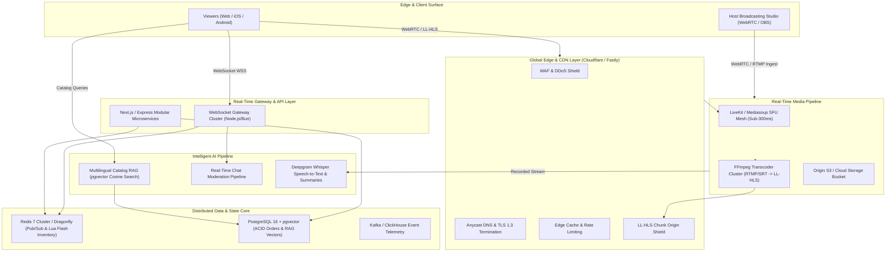
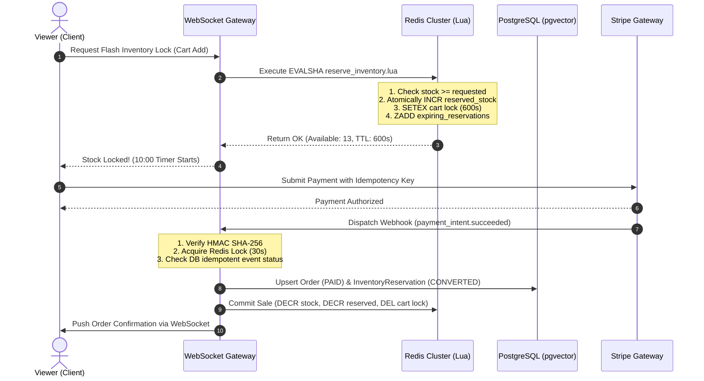

# 🌟 PROJECT SUPERNOVA: ENTERPRISE ARCHITECTURAL BLUEPRINT
### Next-Generation Ultra-Premium Live Video Commerce Platform

---

## 1. System Topology & Global Tech Stack

---

## 2. Technology Stack Selection & Justification

| Layer | Technology | Primary Function | Justification & Scale Profile |
| :--- | :--- | :--- | :--- |
| **Frontend** | Next.js 14 (App Router) + React 18 + Tailwind CSS + Framer Motion | Live Client, Host Dashboard, Slideout Cart | Sub-second hydration, layout stability, luxury glassmorphic design tokens. |
| **Media SFU** | LiveKit / Mediasoup SFU Cluster | Ultra-low latency video broadcast (<300ms) | WebRTC Selective Forwarding Unit eliminates peer transcoding overhead; auto-scales to 5k viewers per room. |
| **Broadcast Fallback** | FFmpeg Transcoder + Low-Latency HLS (LL-HLS) | Mass distribution (100k+ concurrent viewers) | Chunked CMAF segments over CDN with 1.8s - 2.5s glass-to-glass latency when SFU crosses threshold. |
| **Realtime Gateway** | Node.js / Bun + `ws` cluster + Redis Pub/Sub | Chat, Host Pinning, Viewer Count, Reactions | Decoupled pub/sub mesh ensures single-message broadcast reaches 100k+ clients in <40ms. |
| **Inventory Core** | Redis 7 Cluster (In-memory Lua scripts) | Flash sale concurrency & atomic inventory locks | Prevents race conditions and overselling; executes stock decrement and 10m TTL locks in 0.8ms. |
| **Relational Database** | PostgreSQL 16 Enterprise | Orders, Live Events, Catalog, Webhooks | Strict ACID guarantees, JSONB flexible attributes, row-level locking. |
| **Vector Engine** | `pgvector` with HNSW Index | Multilingual Catalog RAG Search | Sub-5ms cosine similarity lookup for 1536-dimensional embeddings without maintaining separate vector DBs. |
| **Payments & Webhooks** | Stripe Elements + HMAC SHA256 Webhook Engine | One-click live checkout & duplicate-free fulfillment | Constant-time signature verification, 300s replay prevention, distributed Redis mutexes. |
| **AI NLP & Speech** | Deepgram Nova-2 + Gemini 1.5 Flash / OpenAI | Live transcription, RAG concierge, event summaries | Multilingual grounding strictly in catalog specs with zero hallucination. |
| **Telemetry** | ClickHouse + OpenTelemetry + Grafana | Drop-off telemetry, sales velocity, live conversion | Ingests 50,000 events/sec with real-time funnel aggregation. |

---

## 3. High-Traffic Flash-Sale Synchronization Protocol

